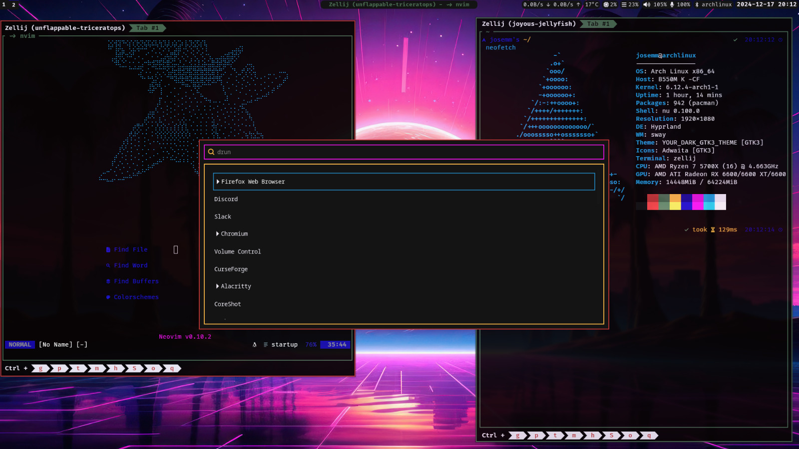
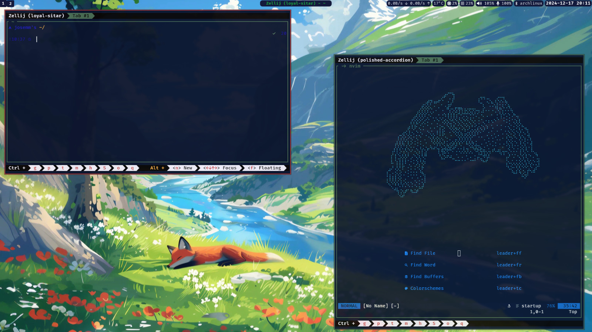
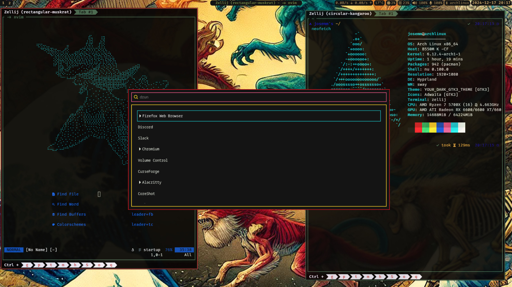
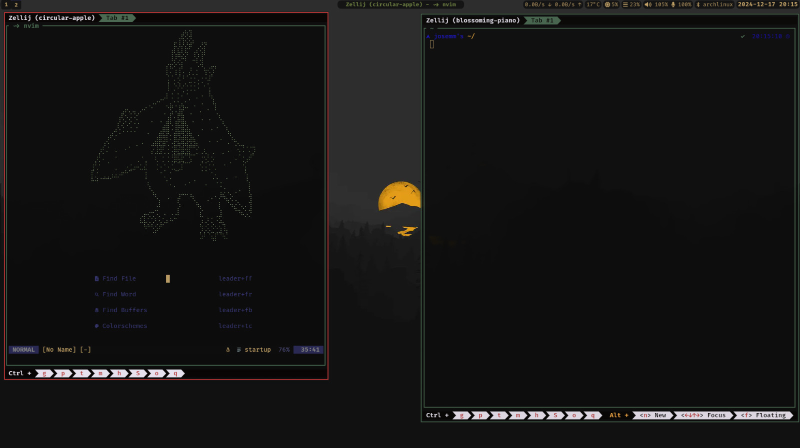

# Walltheme

Walltheme is a terminal theme generator implemented in Rust. It extracts colors from an image and applies them to predefined templates to generate themes for terminal emulators, text editors, and other applications. The tool supports all standard colors (black, red, white, etc.), and includes an extra orange color specifically for **Zellij**.

Walltheme comes with several templates and example scripts to facilitate customization.

---

## Table of Contents

- [Features](#features)
- [Installation](#installation)
  - [Prerequisites](#prerequisites)
  - [Build from Source](#build-from-source)
- [Usage](#usage)
  - [Basic Command](#basic-command)
  - [Example](#example)
- [Templates](#templates)
  - [Example Template](#example-template)
  - [Provided Templates](#provided-templates)
- [Configuration Options](#configuration-options)
  - [Example Configuration](#example-configuration)
  - [Available Options](#available-options)
- [Examples](#examples)
- [NeoVim Integration](#neovim-integration)
- [Contributing](#contributing)
- [License](#license)
- [Acknowledgements](#acknowledgements)
- [Screenshots](#screenshots)
  - [Generated Themes in Action](#generated-themes-in-action)

---

## Features

- **Extract Colors from an Image**: Automatically extracts primary colors like black, red, white, and others from a provided image.
- **Zellij Support**: Includes an additional orange color for Zellij.
- **Template-based Generation**: Uses customizable templates to generate configuration files for terminals, text editors, and more.
- **Example Scripts**: Predefined scripts and templates for quick integration.
- **Rust Implementation**: High performance and reliability.

---

## Installation

### Prerequisites

- Rust (https://www.rust-lang.org/tools/install)

### Build from Source

```bash
# Clone the repository
mkdir -p ~/.cache/walltheme/ && mkdir -p ~/.config/walltheme/templates
git clone https://github.com/JoseMM2002/walltheme.nvim.git
cd walltheme
# Build the project
cargo install --path .
```

---

## Usage

### Basic Command

To generate a theme:

```bash
walltheme <image-path>
```

### Example

```bash
walltheme ~/Pictures/wallpaper.png
```

This command extracts colors from `wallpaper.png`, generates config files using templates from `~/.config/walltheme/templates` and saves them into `~/.cache/walltheme/`.

---

## Templates

Walltheme uses templates to format the generated theme files. Placeholders are replaced with extracted colors. This templates are generated by handlebars.

### Example Template

```plaintext
#{{black_hex}}
#{{red_hex}}
#{{green_hex}}
#{{blue_hex}}
rgb{{black_rgb}}
rgb{{red_rgb}}
rgb{{green_rgb}}
rgb{{blue_rgb}}
rgba{{black_rgba}}
rgba{{red_rgba}}
rgba{{green_rgba}}
rgba{{blue_rgba}}


# Custom colors
{{colorName_hex}}
{{colorName_rgb}}
{{colorName_rgba}}

# Keep this info
{{keep "info to keep"}} -> {{info to keep}}
```

### Provided Templates

Walltheme includes templates for:

- Kitty Terminal
- Waybar
- Oh My Posh
- Zellij
- Nushell
- wofi

Templates are located in the `templates/` directory. To use them, copy the desired template to `~/.config/walltheme/templates/` and modify it as needed.

---

## Configuration Options

You can customize Walltheme by creating or modifying a `config` file located at `~/.config/walltheme/config.toml`. This file allows you to fine-tune the behavior of the theme generation, including palette settings and thresholds.

### Example Configuration

```toml
[general]
mix_factor = 0.7 # from 0 to 1
distance_threshold = 0.5 # from 0 to 1
palette_quality = 16 # from 1 to 255
palette_max_colors = 8 # from 1 to 255
brighter_factor = 0.8 # from 0 to 1
bright_min = 20 # from 0 to 255
opacity_target = 50 # from 0 to 255
stdout_template = "colors.sh"

[color.colorName]
# Color Value
rgb = [0, 0, 0] # RGB values or
hex = "#000000" # Hex value or
# Index in the palette from the extracted colors (related to the palette_max_colors)
pallete_index = 0

# Color Options
mix_factor = 0.7
distance_threshold = 0.5
brighter_factor = 0.8
bright_min = 20
opacity_target = 50


#Examples

[color.primary]
palette_index = 0
[color.secondary]
palette_index = 1
[color.tertiary]
palette_index = 2

[color.orange]
rgb = [255, 165, 0]
#or
hex = "#ffa500"
```

### Available Options

- `mix_factor`: Mix factor for blending colors.
- `distance_threshold`: Threshold for color distance filtering.
- `palette_quality`: Quality of the palette extraction.
- `palette_max_colors`: Maximum number of colors to extract.
- `brighter_factor`: Factor to adjust color brightness.
- `bright_min`: Minimum brightness threshold.
- `stdout_template`: Template for standard output.
- `opacity_target`: Target opacity for colors.

You can also add new colors or modify existing ones by adding a section for each color.

- `rgb`: RGB values for the color.
- `hex`: Hex value for the color. (if `rgb` is not provided)
- `palette_index`: Index in the palette from the extracted colors.
- `mix_factor`: Mix factor for blending colors.
- `distance_threshold`: Threshold for color distance filtering.
- `brighter_factor`: Factor to adjust color brightness.
- `bright_min`: Minimum brightness threshold.
- `opacity_target`: Target opacity for colors.

You can set these options to suit your preferences and workflow.

---

### Examples

An example for my setup is in the `scripts/examples/` directory. It includes a script that sets the wallpaper and generates themes for Kitty, Waybar, and Zellij.

### NeoVim Integration

To integrate this with NeoVim, I had made a plugin that uses the generated theme to set the colorscheme. You can find it [walltheme.nvim](https://github.com/JoseMM2002/walltheme.nvim)

---

## Contributing

Contributions are welcome! Feel free to open an issue or submit a pull request.

1. Fork the repository.
2. Create a new branch: `git checkout -b feature/your-feature`.
3. Make changes and commit: `git commit -m "Add your feature"`.
4. Push your branch: `git push origin feature/your-feature`.
5. Submit a pull request.

---

## License

This project is licensed under the MIT License. See the LICENSE file for more details.

---

## Acknowledgements

Special thanks to tools like [Pywal](https://github.com/dylanaraps/pywal) and inspiration from terminal theming communities.

---

## Screenshots

### Generated Themes in Action








